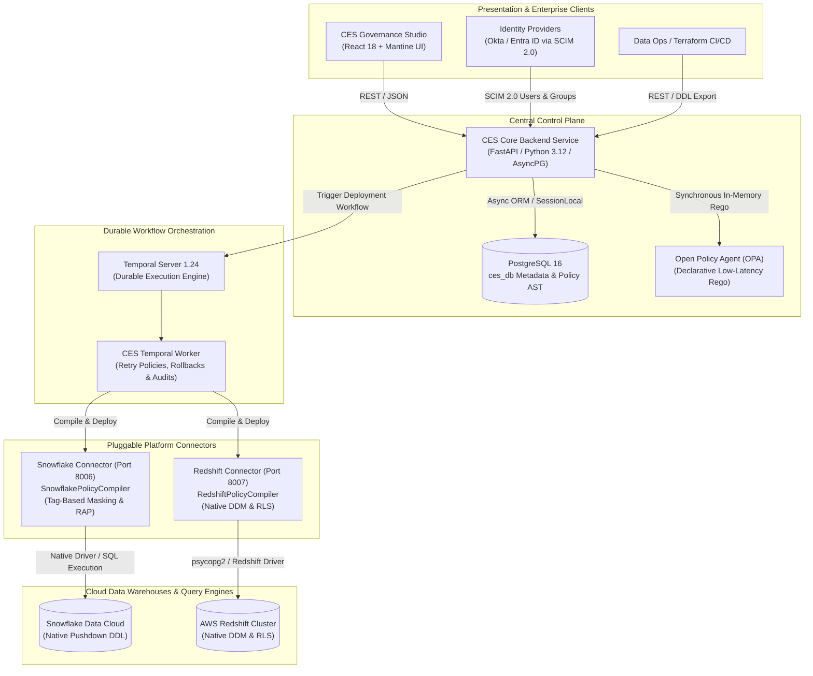
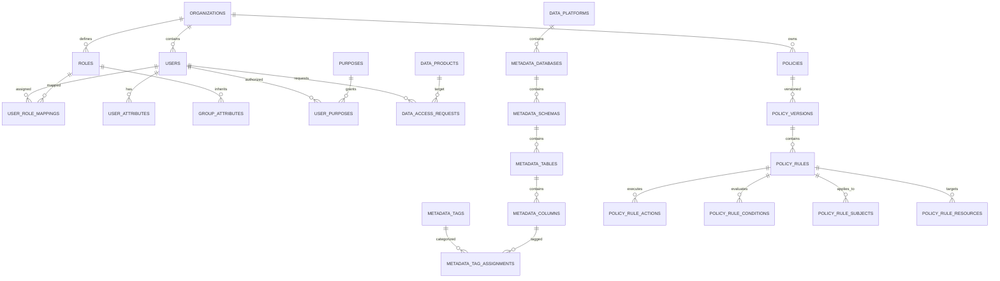

# Central Entitlement Service (CES)

### Enterprise-Grade Cloud Data Access Governance, ABAC/PBAC & Multi-Engine Policy Compiler

\---

## 1. Executive Summary & Business Value

### The Enterprise Challenge

Modern data estates span diverse cloud platforms—**Snowflake**, **Amazon Redshift**, **Databricks**, and **PostgreSQL**. Traditional Role-Based Access Control (RBAC) quickly leads to **"Role Explosion"** (thousands of static, brittle roles), blind spots in sensitive data discovery, and slow manual access provisioning. Organizations face stringent data privacy mandates (**GDPR Article 5(1)(b)** Purpose Limitation, **PCI-DSS Requirement 3** Cardholder Masking, and **HIPAA §164.502(b)** Minimum Necessary Disclosure).

### The CES Solution

**Central Entitlement Service (CES)** is a unified, open-source data entitlement platform modeled after the **Immuta enterprise data security paradigm**. CES provides:

1. **Global Policy Builder**: Define a policy *once* (e.g., *"Mask columns classified as PII.Email for all users except Fraud Auditors with active business purpose"*), and compile it automatically into platform-specific SQL DDL or DDM & RLS SQL and OPA policies.
2. **Zero-Proxy Performance**: Compiles native SQL DDL (Snowflake Dynamic Masking Policies, Row Access Policies, Amazon Redshift Native DDM, and Redshift RLS) pushed directly to the underlying engines—ensuring **0 ms query overhead**.
3. **Purpose-Based Access Control (PBAC)**: Evaluates *why* data is needed (e.g., Regulatory Audit vs Customer Support), applying strict time-bound subscriptions and purpose limitations required by privacy regulations.
4. **Attribute-Based Identity Governance (ABAC)**: Dynamic multi-group attribute inheritance, SCIM 2.0 Okta/Entra ID ingestion, and real-time effective attribute resolution.
5. **Continuous Sensitive Data Discovery (DSPM)**: Automated dictionary and regex scanning against metadata catalogs with hierarchical taxonomy tagging (`Discovered.PII.*`, `Compliance.HIPAA.*`).

---

## 2. System Architecture

CES is designed as a distributed, event-driven, microservices-based system orchestrated with **Temporal** workflows and verified with **Open Policy Agent (OPA)**.



---

## 3. Core Governance Paradigms

### A. Purpose-Based Access Control (PBAC)

Instead of granting permanent static permissions based on job title, PBAC verifies the **contextual business purpose** of data access:

- **Business Purpose Registry**: Standard business mandates (`FRAUD_DETECTION`, `REGULATORY_AUDIT`, `CUSTOMER_SERVICE_SUPPORT`, `MARKETING_CAMPAIGN`, `HIPAA_PATIENT_CARE`).
- **User Purpose Authorization**: Fine-grained authorization connecting identities to active approved business purposes.
- **Time-Bound Entitlement Requests**: Data consumers request temporary subscriptions (e.g. 30 days) scoped to a purpose. Approvals dynamically adjust live policy evaluations.

### B. Dynamic Attribute-Based Access Control (ABAC) & Identity Governance

- **SCIM 2.0 Standard Ingestion**: Ingest users and groups from Okta, Azure AD, or Ping Identity (`/api/v1/scim/v2/Users`).
- **Group Attribute Inheritance**: Attributes assigned to groups (e.g., `ROLE_FINANCE_ANALYST` inherits `sox_auditor: true`, `security_clearance: level_3`) automatically propagate to members.
- **Effective Attribute Resolver**: Real-time evaluation endpoint (`GET /api/v1/users/{id}/effective-attributes`) merging direct user attributes with inherited group attributes.

### C. Hierarchical Tag Taxonomy & Automated Discovery

- **Dot-Notation Hierarchy**: Tags structured as parent-child nodes (`Discovered.PII.Email`, `Governance.Confidentiality.Restricted`).
- **Automated Discovery Engine**: Pattern-matching scanner evaluating column names and data dictionary metadata to discover sensitive columns and bind tags without manual intervention.
- **Tag-Based Global Policy Binding**: Policies bound to tags automatically govern all current and future data assets carrying matching metadata tags across all clouds.

---

## 4. Multi-Engine Policy Compilation

CES features dedicated platform-specific policy compilers residing within each platform connector:

### 1. Snowflake Platform Compiler (\[`snowflake-connector`\](file:///d:/project/Central%20Entitlement%20Service/centralPolicyManager/snowflake-connector/src/compiler.py))

Generates directly-applicable Snowflake SQL scripts:

```sql
-- 1. Governance Setup
USE ROLE ACCOUNTADMIN;
CREATE DATABASE IF NOT EXISTS GOVERNANCE_DB;
CREATE SCHEMA IF NOT EXISTS GOVERNANCE_DB.POLICIES;
CREATE SCHEMA IF NOT EXISTS GOVERNANCE_DB.TAGS;

-- 2. Tag-Based Masking Policy (Immuta Global Paradigm)
CREATE OR REPLACE MASKING POLICY GOVERNANCE_DB.POLICIES.mask_customer_pii_email AS (val VARCHAR) RETURNS VARCHAR ->
  CASE
    WHEN CURRENT_ROLE() IN ('ACCOUNTADMIN', 'CES_ROLE_COMPLIANCE') THEN val
    WHEN GETVARIABLE('CES_PURPOSE') IN ('FRAUD_DETECTION') THEN val
    ELSE SHA2(val, 256)
  END;

-- 3. Bind Policy Directly to Snowflake Tag across entire Cloud Account
ALTER TAG GOVERNANCE_DB.TAGS.DISCOVERED_PII_EMAIL SET MASKING POLICY GOVERNANCE_DB.POLICIES.mask_customer_pii_email;
GRANT APPLY ON MASKING POLICY GOVERNANCE_DB.POLICIES.mask_customer_pii_email TO ROLE CES_ROLE_ANALYST;

-- 4. Native Row Access Policy (RAP)
CREATE OR REPLACE ROW ACCESS POLICY GOVERNANCE_DB.POLICIES.rap_customer_region AS (col_val VARCHAR) RETURNS BOOLEAN ->
  CURRENT_ROLE() IN ('ACCOUNTADMIN') OR (CURRENT_ROLE() IN ('CES_ROLE_ANALYST') AND col_val = 'US_EAST');

ALTER TABLE FINANCE_DB.PUBLIC.CUSTOMER_PROFILES ADD ROW ACCESS POLICY GOVERNANCE_DB.POLICIES.rap_customer_region ON (REGION);
```

### 2. Amazon Redshift Platform Compiler (\[`redshift-connector`\](file:///d:/project/Central%20Entitlement%20Service/centralPolicyManager/redshift-connector/src/compiler.py))

Generates native Amazon Redshift Dynamic Data Masking (DDM) and Row-Level Security (RLS) scripts:

```sql
-- 1. Native Redshift Dynamic Data Masking (DDM)
CREATE MASKING POLICY mask_customer_profiles_email
WITH (val VARCHAR)
USING (
  CASE
    WHEN CURRENT_USER IN ('admin', 'awsuser') OR pg_has_role(CURRENT_USER, 'ces_role_compliance', 'MEMBER') THEN val
    ELSE SHA2(val, 256)
  END
);

ATTACH MASKING POLICY mask_customer_profiles_email ON public.customer_profiles(email) TO ROLE ces_role_analyst;

-- 2. Native Redshift Row-Level Security (RLS)
CREATE RLS POLICY rls_customer_profiles_region
WITH (region VARCHAR)
USING (region = 'US_EAST');

ATTACH RLS POLICY rls_customer_profiles_region ON public.customer_profiles TO ROLE ces_role_analyst;

-- 3. Mandatory Table RLS Activation in Amazon Redshift
ALTER TABLE public.customer_profiles ROW LEVEL SECURITY ON;
ALTER TABLE public.customer_profiles ROW LEVEL SECURITY CONJUNCTIVE;
```

### 3. Open Policy Agent (OPA) Evaluation (\[`backend-service/src/services/policy_compiler.py`\](file:///d:/project/Central%20Entitlement%20Service/centralPolicyManager/backend-service/src/services/policy_compiler.py))

Generates declarative OPA Rego policies for in-memory, microsecond API authorization:

```rego
package ces.policies.customer_pii_protect

import rego.v1

default allow := false
default mask_action := null

mask_action := "HASH_SHA256" if {
    input.resource.column == "email"
    not is_exempt
}

is_exempt if {
    input.user.roles[_] in ["ROLE_COMPLIANCE"]
}

is_exempt if {
    input.user.attributes.purpose == "FRAUD_DETECTION"
}
```

---

## 5. Database Schema & Data Model Deep Dive

The CES PostgreSQL schema (`ces_db`) is structured into five relational domains:



### Table Definitions & Purpose:

| Table Name | Description | Key Governance Fields |
| --- | --- | --- |
| `organizations` | Multi-tenant root organization entity | `org_id`, `org_name`, `org_code` |
| `users` | Governed identity accounts (local or SCIM IdP) | `user_id`, `username`, `email`, `department`, `is_active` |
| `roles` | Identity access groups / RBAC roles | `role_id`, `role_code`, `role_name`, `is_system` |
| `user_attributes` | Direct ABAC metadata attributes attached to users | `user_id`, `attribute_key`, `attribute_value`, `data_type` |
| `group_attributes` | Group-level ABAC attributes inherited by all members | `role_id`, `attribute_key`, `attribute_value` |
| `purposes` | PBAC contextual business purposes & mandates | `purpose_id`, `purpose_code`, `purpose_name`, `compliance_mandate` |
| `user_purposes` | Authorizations granting users access under a purpose | `user_id`, `purpose_id`, `authorized_by`, `valid_until` |
| `data_access_requests` | Entitlement access & subscription requests workflow | `request_id`, `requestor_id`, `product_id`, `status`, `expires_at` |
| `metadata_platforms` | Connected cloud engines (Snowflake, Redshift, etc.) | `platform_id`, `platform_code`, `connection_alias`, `host` |
| `metadata_tables` | Governed catalog tables across all cloud engines | `table_id`, `schema_id`, `table_name`, `row_count_approx` |
| `metadata_columns` | Governed catalog column schema definitions | `column_id`, `table_id`, `column_name`, `data_type` |
| `metadata_tags` | Hierarchical taxonomy metadata tags | `tag_id`, `tag_name`, `full_path`, `parent_tag_id`, `tag_category` |
| `metadata_tag_assignments` | Mappings binding tags to catalog columns/tables | `assignment_id`, `tag_id`, `column_id`, `confidence_score` |
| `policies` | Central policy entity | `policy_id`, `policy_code`, `policy_name`, `enforce_mode`, `status` |
| `policy_versions` | Immutable version history of policy specifications | `version_id`, `policy_id`, `version_number`, `is_current` |
| `policy_rules` | Logical rules within a policy version | `rule_id`, `version_id`, `rule_type`, `effect` (`ALLOW`/`DENY`) |
| `policy_rule_actions` | Actions executed (`MASK_COLUMN`, `FILTER_ROWS`, etc.) | `action_id`, `rule_id`, `action_type`, `mask_type`, `filter_column` |
| `policy_rule_conditions` | Context & purpose evaluation conditions | `condition_id`, `rule_id`, `attribute_key`, `operator`, `compare_value` |
| `policy_rule_subjects` | Target subjects (`ROLE` or `USER`) | `subject_id`, `rule_id`, `subject_type`, `role_id`, `user_id` |
| `policy_rule_resources` | Target resources (`TABLE`, `TAG`, `DATABASE`) | `resource_id`, `rule_id`, `resource_scope`, `platform_id` |

---

## 6. Service Catalog & Port Allocation

When deployed with Docker Compose, CES provisions the following coordinated services:

| Container Name | Service | Technology | Port / Endpoint | Purpose |
| --- | --- | --- | --- | --- |
| `ces-frontend` | Control Plane UI | React 18 / Mantine / Vite / Nginx | [**http://localhost:80**](http://localhost:80) | DSPM Dashboard, Policy Studio, Identity & PBAC Studio |
| `ces-backend-service` | Core API | FastAPI / Python 3.12 / AsyncPG | [**http://localhost:8000/docs**](http://localhost:8000/docs) | REST API, Compiler Engine, SCIM Ingestion |
| `ces-postgres` | System Catalog DB | PostgreSQL 16 Alpine | `localhost:5433` (mapped) | Core relational storage (`ces_db`) |
| `ces-opa` | Policy Evaluation Engine | Open Policy Agent | `http://localhost:8181/` | Declarative sub-millisecond Rego decision engine |
| `ces-temporal` | Workflow Engine | Temporalio Server 1.24 | `temporal:7233` | Durable execution for multi-engine deployments |
| `ces-temporal-ui` | Workflow Dashboard | Temporal Web UI | [**http://localhost:8088**](http://localhost:8088) | Live visualization of policy deployment runs |
| `ces-snowflake-connector` | Snowflake Agent | FastAPI / Snowflake-Python Driver | `http://localhost:8006/` | Native Snowflake compiler & test connector |
| `ces-redshift-connector` | Redshift Agent | FastAPI / Redshift Connector / Psycopg2 | `http://localhost:8007/` | Native Redshift DDM compiler & test connector |

---

## 7. Quickstart: Running the Complete Stack

### Prerequisites

- **Docker Desktop** (v24.0+ with Docker Compose v2.20+)
- **Git**

### Single-Command Launch

Clone the repository and run Docker Compose from the root directory:

```bash
git clone https://github.com/your-org/centralPolicyManager.git
cd centralPolicyManager

# Launch the complete enterprise stack
docker compose up -d --build
```

### Verification

Wait 30–45 seconds for database migrations, Temporal schema registration, and frontend compilation to initialize. Then verify:

1. Open [**http://localhost/dashboard**](http://localhost/dashboard) to view the live **Data Security Posture (DSPM)** dashboard.
2. Open [**http://localhost/policies**](http://localhost/policies) to view active data access policies.
3. Open [**http://localhost:8000/docs**](http://localhost:8000/docs) to inspect the OpenAPI / Swagger documentation.
4. Open [**http://localhost:8088**](http://localhost:8088) to view the Temporal Workflow Execution dashboard.

---

## 8. Docker Operations & CLI Reference

### A. Core Stack Lifecycle Commands

```bash
# 1. Start entire stack in background with automatic build
docker compose up -d --build

# 2. View live status and port bindings of all CES containers
docker compose ps

# 3. View real-time resource consumption (CPU, Memory, Network I/O)
docker stats --format "table {{.Name}}\t{{.CPUPerc}}\t{{.MemUsage}}\t{{.NetIO}}"

# 4. Stop all services without deleting data volumes
docker compose stop

# 5. Resume stopped services
docker compose start

# 6. Completely tear down stack (preserves persistent volumes)
docker compose down

# 7. Complete clean teardown (WARNING: purges database volumes and logs)
docker compose down -v --remove-orphans
```

### B. Targeting Individual Microservices

```bash
# Rebuild and restart only the backend-service (FastAPI)
docker compose up -d --build backend-service

# Rebuild and restart only the frontend-service (React/Nginx)
docker compose up -d --build frontend-service

# Restart the OPA policy engine to reload Rego files
docker compose restart opa

# Restart the Temporal workflow orchestrator
docker compose restart temporal

# Restart platform connectors
docker compose restart snowflake-connector redshift-connector
```

### C. Live Log Streaming & Diagnostics

```bash
# Stream live logs from backend-service (last 100 lines)
docker logs -f --tail 100 ces-backend-service

# Stream live OPA policy evaluation audit events
docker logs -f --tail 50 ces-opa

# Stream live Temporal workflow execution events
docker logs -f --tail 50 ces-backend-service | grep -i "temporal"

# Filter logs for errors and critical warnings across all services
docker compose logs --tail 200 | grep -E "(ERROR|CRITICAL|Failed|Exception)"

# Inspect Frontend Nginx access and error logs
docker logs -f --tail 50 ces-frontend
```

### D. Interactive Shells & Container Debugging

```bash
# Open interactive bash terminal inside Core Backend Service
docker exec -it ces-backend-service /bin/bash

# Open PostgreSQL CLI (psql) inside ces-postgres container
docker exec -it ces-postgres psql -U ces_user -d ces_db

# Query active policy counts directly in PostgreSQL
docker exec -it ces-postgres psql -U ces_user -d ces_db -c \
  "SELECT policy_code, enforce_mode, status FROM policies;"

# Query sensitive tag taxonomy counts directly
docker exec -it ces-postgres psql -U ces_user -d ces_db -c \
  "SELECT tag_category, COUNT(*) FROM metadata_tags GROUP BY tag_category;"

# Test internal inter-container DNS and connectivity from backend
docker exec -it ces-backend-service python -c "
import httpx
print('OPA Health:', httpx.get('http://opa:8181/health').status_code)
print('Snowflake Connector:', httpx.get('http://snowflake-connector:8006/health').status_code)
print('Redshift Connector:', httpx.get('http://redshift-connector:8007/health').status_code)
"
```

### E. Database Backup & Disaster Recovery

```bash
# Create an on-demand SQL dump of the complete database (schema + data)
docker exec ces-postgres pg_dump -U ces_user -d ces_db -F p > ces_db_backup_$(date +%Y%m%d).sql

# Restore database from SQL backup dump
docker exec -i ces-postgres psql -U ces_user -d ces_db < ces_db_backup.sql

# Re-apply fresh schema files manually into running container
docker exec -i ces-postgres psql -U ces_user -d ces_db < database/schema/001_core_domain.sql
docker exec -i ces-postgres psql -U ces_user -d ces_db < database/schema/002_metadata.sql
docker exec -i ces-postgres psql -U ces_user -d ces_db < database/schema/003_policies.sql
docker exec -i ces-postgres psql -U ces_user -d ces_db < database/seeds/004_sample_data.sql
```

---

## 9. Comprehensive Troubleshooting Playbook

### Issue 1: Port Conflict on Host Machine
- **Symptoms**: `Error response from daemon: Ports are not available: exposing port TCP 0.0.0.0:5432 -> listen tcp 0.0.0.0:5432: bind: address already in use`
- **Root Cause**: Local PostgreSQL or another service is already bound to port `5432` on your host.
- **Resolution**: CES maps host port **`5433`** to container port `5432` (`"5433:5432"` in `docker-compose.yml`). If you need to change other exposed ports:
  - Frontend: Edit `80:80` to `8080:80`
  - Backend API: Edit `8000:8000` to `8005:8000`
  - Temporal UI: Edit `8088:8080` to `8089:8080`

### Issue 2: OPA Policy Syntax or Undefined Function Errors
- **Symptoms**: `POST /api/v1/validation` returns `OPA skipped` or OPA container exits on startup.
- **Root Cause**: Rego v1 syntax mismatch or invalid Rego syntax in `backend-service/rego/`.
- **Resolution**:
  1. Inspect OPA startup errors: `docker logs ces-opa --tail 50`
  2. Verify all `.rego` files begin with `package <pkg_name>` and `import rego.v1`.
  3. Hot-reload OPA without restarting other containers:
     ```bash
     docker restart ces-opa
     curl -s http://localhost:8181/v1/data | jq .
     ```

### Issue 3: Temporal Worker Not Processing Policy Deployments
- **Symptoms**: Deployments remain in `PENDING` or `DEPLOYING` state indefinitely.
- **Root Cause**: Temporal worker disconnected or Temporal schema registration incomplete.
- **Resolution**:
  1. Verify Temporal cluster health:
     ```bash
     docker logs ces-temporal --tail 20
     ```
  2. Confirm Temporal namespace registration completed:
     ```bash
     docker logs ces-temporal-ns-register
     ```
  3. Open Temporal Web UI at **[http://localhost:8088](http://localhost:8088)** and inspect active workflows on task queue `policy-deployment`.
  4. Restart backend worker: `docker restart ces-backend-service`.

### Issue 4: Frontend UI Changes Not Appearing (Stale Bundle)
- **Symptoms**: Code edits in React UI do not show in browser on `http://localhost`.
- **Root Cause**: Nginx / Docker layer cache retained previous production build bundle.
- **Resolution**:
  ```bash
  docker compose build --no-cache frontend-service
  docker compose up -d frontend-service
  ```
  *(Or perform a hard browser refresh via `Ctrl + Shift + R` or `Cmd + Shift + R`).*

### Issue 5: Database Primary Key Collision (`duplicate key value violates unique constraint`)
- **Symptoms**: Creating a new policy, tag, or user returns `500 Internal Server Error` referencing unique constraint violation on `_id_seq`.
- **Root Cause**: Records were inserted with explicit IDs during seeding without advancing the PostgreSQL auto-increment sequences.
- **Resolution**: Run the sequence synchronization block:
  ```bash
  docker exec -it ces-postgres psql -U ces_user -d ces_db -c "
    SELECT setval('policies_policy_id_seq', COALESCE((SELECT MAX(policy_id) FROM policies), 1));
    SELECT setval('policy_versions_version_id_seq', COALESCE((SELECT MAX(version_id) FROM policy_versions), 1));
    SELECT setval('policy_rules_rule_id_seq', COALESCE((SELECT MAX(rule_id) FROM policy_rules), 1));
    SELECT setval('purposes_purpose_id_seq', COALESCE((SELECT MAX(purpose_id) FROM purposes), 1));
    SELECT setval('data_access_requests_request_id_seq', COALESCE((SELECT MAX(request_id) FROM data_access_requests), 1));
    SELECT setval('metadata_tags_tag_id_seq', COALESCE((SELECT MAX(tag_id) FROM metadata_tags), 1));
  "
  ```

---

## 10. Development & Local Testing Guide

### Running Backend Service Locally (Without Docker)

```bash
cd backend-service
python -m venv .venv
source .venv/bin/activate  # Or on Windows: .venv\Scripts\activate
pip install uv
uv pip install -e .

# Run Uvicorn with auto-reload
uvicorn src.main:app --host 0.0.0.0 --port 8000 --reload
```

### Running Frontend Service Locally (Without Docker)

```bash
cd frontend-service
npm install
npm run dev
# Access Vite live HMR at http://localhost:5173
```

### Running the Test Suite

```bash
docker exec -it ces-backend-service pytest -v
```

---

## 11. Security & Production Deployment Checklist


- [ ] **Rotate Default Credentials**: Change `SECRET_KEY`, `PG_PASSWORD`, and database passwords in `.env`.

- [ ] **Enable TLS / HTTPS**: Configure Nginx or reverse proxy SSL certificates for production frontend and API gateways.

- [ ] **Configure Real Cloud IAM**: Provide IAM roles or AWS Secret Manager credentials for Snowflake and Amazon Redshift connection testing.

- [ ] **Connect Enterprise IdP**: Direct your Okta or Azure AD SCIM provisioner to `https://<your-domain>/api/v1/scim/v2/Users`.

- [ ] **Temporal Persistent Storage**: In production, ensure PostgreSQL storage volumes for `temporal` and `temporal_visibility` are backed by managed storage (e.g. AWS RDS Aurora PostgreSQL).

---

## 10. License & Contributing

Licensed under the **Apache License 2.0**. Contributions, bug reports, and architectural RFCs are welcome via GitHub Pull Requests.