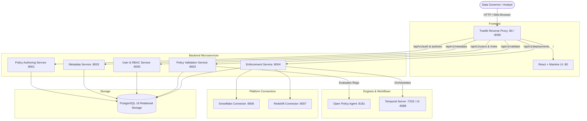

# Walkthrough: Open-Source Immuta Clone Implementation

We have designed and implemented an enterprise-grade, open-source centralized policy authoring and multi-platform data access governance platform (**PolicyHub**).

---

## 🏛️ System Architecture Summary

The platform operates across 11 synchronized Docker container services:



---

## 🔑 Key Deliverables

### 1. Relational Normalized PostgreSQL Schema (No JSONB)
- [001_core_domain.sql](file:///d:/project/Immuta_Clone/database/schema/001_core_domain.sql): Organizations, data domains, data products, users, roles, recursive role mappings, and ABAC user attributes.
- [002_metadata.sql](file:///d:/project/Immuta_Clone/database/schema/002_metadata.sql): Platform registry, databases, schemas, tables, columns, tags, and product-to-table mappings.
- [003_policies.sql](file:///d:/project/Immuta_Clone/database/schema/003_policies.sql): Normalized policies, policy versions, rules, rule subjects, actions (column masking & row filtering), conditions, and platform targets.
- [001_sample_data.sql](file:///d:/project/Immuta_Clone/database/seeds/001_sample_data.sql): Full demo dataset with pre-seeded users (`alice.chen`, `bob.smith`, `admin`, etc.) with bcrypt hashed passwords (`Password123!`).

### 2. Self-Contained JWT Authentication
- [shared-libs/auth.py](file:///d:/project/Immuta_Clone/shared-libs/auth.py): Standalone HS256 JWT auth module with password hashing (bcrypt), token issuance, refresh, and role-based access dependency factories (`require_roles`).

### 3. Backend Microservices (FastAPI + Async SQLAlchemy + Pydantic V2)
- **Policy Authoring Service** ([main.py](file:///d:/project/Immuta_Clone/policy-authoring-service/src/main.py)): Full policy lifecycle (Drafting, Versioning, Submissions, Rollbacks, Deprecation).
- **Policy Validation Service** ([main.py](file:///d:/project/Immuta_Clone/policy-validation-service/src/main.py)): 4-gate validation pipeline using OPA Rego rules ([policy_validate.rego](file:///d:/project/Immuta_Clone/policy-validation-service/rego/policy_validate.rego), [rbac_rules.rego](file:///d:/project/Immuta_Clone/policy-validation-service/rego/rbac_rules.rego)).
- **Metadata Service** ([main.py](file:///d:/project/Immuta_Clone/metadata-service/src/main.py)): Catalog search, hierarchy traversal (Platform -> DB -> Schema -> Table -> Column), and Data Products mapping.
- **User & RBAC Service** ([main.py](file:///d:/project/Immuta_Clone/user-rbac-service/src/main.py)): Role hierarchies (recursive CTE query), ABAC attribute management, and user profiles.
- **Enforcement Service** ([main.py](file:///d:/project/Immuta_Clone/enforcement-service/src/main.py)): Orchestrates multi-platform policy translation and deployment state tracking.
- **Connectors**:
  - [Snowflake Connector](file:///d:/project/Immuta_Clone/snowflake-connector/src/main.py): Translates unified rules into Snowflake-native Tag-based Masking Policies and Row Access Policies.
  - [Redshift Connector](file:///d:/project/Immuta_Clone/redshift-connector/src/main.py): Translates unified rules into Redshift-native Row-Level Security (RLS) policies and GRANTs.

### 4. Modern React + Mantine UI Frontend
- **Dark-mode UI** with custom styling, glassmorphism cards, and responsive layout.
- **Policy Studio** ([PolicyStudioPage.tsx](file:///d:/project/Immuta_Clone/frontend-service/src/pages/Policies/PolicyStudioPage.tsx)): 3-step authoring wizard with RBAC/ABAC rule builder, column masking selector, and multi-platform targets.
- **Data Catalog** ([DataCatalogPage.tsx](file:///d:/project/Immuta_Clone/frontend-service/src/pages/DataCatalog/DataCatalogPage.tsx)): Interactive tree explorer for platforms, databases, tables, and columns with instant search.
- **Roles & Users Explorer** ([RoleManagerPage.tsx](file:///d:/project/Immuta_Clone/frontend-service/src/pages/Roles/RoleManagerPage.tsx)): Role hierarchies and ABAC attributes.
- **Deployment Monitor** ([DeploymentsPage.tsx](file:///d:/project/Immuta_Clone/frontend-service/src/pages/Deployments/DeploymentsPage.tsx)): Real-time tracking of platform deployment status.

---

## 🚀 How to Run and Verify

```bash
# 1. Start all 11 services
docker compose up -d

# 2. Access the Web Application
Open http://localhost

# 3. Login with Seed Credentials
Username: admin
Password: Password123!
```
